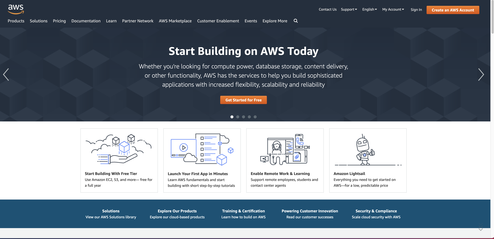
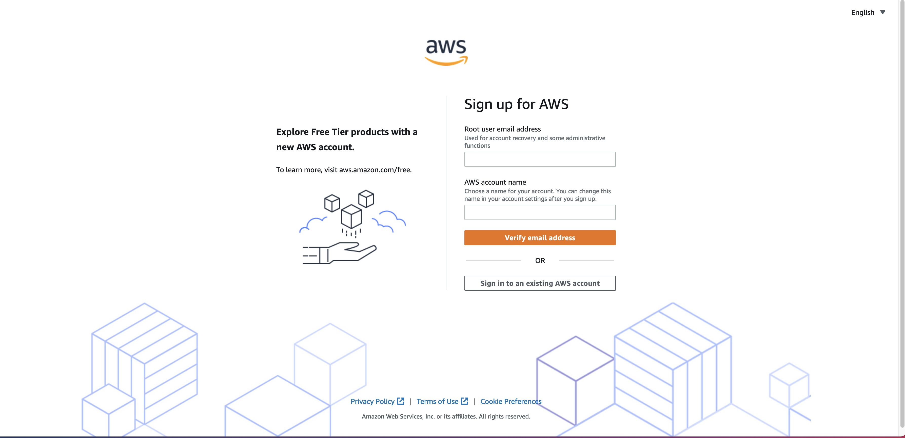
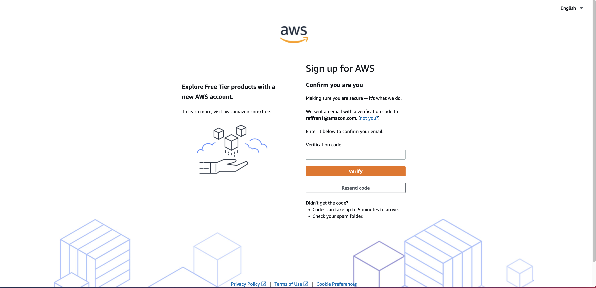
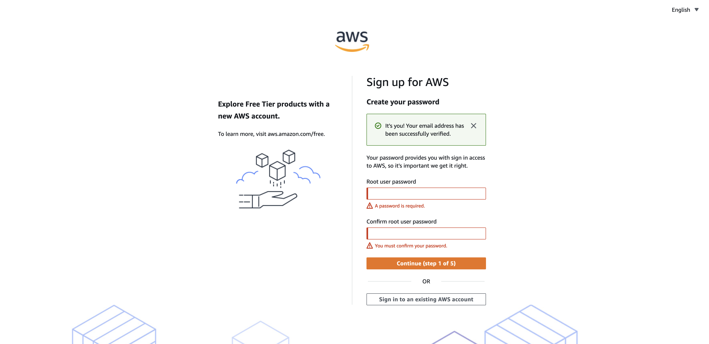
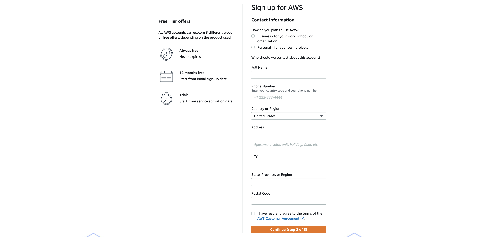
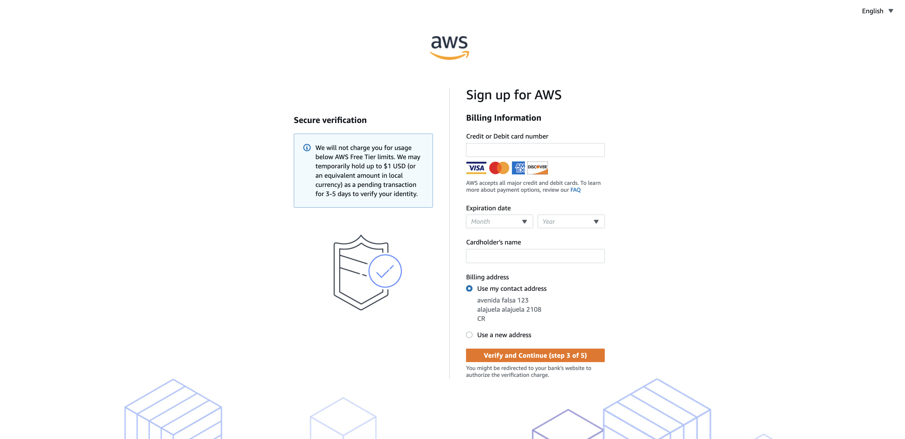

<h1 align="center">NABP Linea de comandos</h1>
<h3 align="center">Mejores practicas para una nueva cuenta de AWS</h3>

- 🔭 [Como crear una nueva cuenta](https://github.com/ELRuncho/nabp#como-crear-una-nueva-cuenta)

- 👤 [Crear usuario administrador](https://github.com/ELRuncho/nabp#crear-usuario-administrador)

- 🚀 [Como instalar nabp](https://github.com/ELRuncho/nabp#como-instalar-nabp)

- 👯 [Comandos core](https://github.com/ELRuncho/nabp#comandos-core)

- 🤝 [Comandos Network](https://github.com/ELRuncho/nabp#comandos-network)

## Como crear una nueva cuenta
1. Abra la [página de inicio de Amazon Web Services (AWS)](https://aws.amazon.com/).
    
2. Elija Create an AWS Account (Crear una cuenta de AWS).
    **Nota:** Si ha iniciado sesión en AWS recientemente, elija Iniciar sesión en la consola. Si Create a new AWS account (Crear una nueva cuenta de AWS) no es visible, elija primero Sign in to a different account (Iniciar sesión con una cuenta diferente) y, a continuación, Create a new AWS account (Crear una nueva cuenta de AWS).
    
3. En Root user email address (Email del usuario raíz), escriba su email, edite el nombre de la cuenta de AWS y, a continuación, elija Verify email address (Verificar email). Se enviará un email de verificación de AWS a esta dirección con un código de verificación.

    **Consejo:** En el caso de la dirección de email del usuario raíz, utilice un buzón o una lista de distribución de email de empresa (por ejemplo, administradores.empresa@ejemplo.com) si su cuenta es una cuenta de AWS profesional. Evite utilizar el email de empresa de una persona (por ejemplo, paulo.santos@ejemplo.com). De este modo, su empresa seguirá teniendo acceso a la cuenta de AWS incluso si un empleado cambia de puesto o deja la empresa. La dirección de email se puede utilizar para restablecer las credenciales de la cuenta. Asegúrese de proteger el acceso a estas listas de distribución. No utilice el inicio de sesión del usuario raíz de la cuenta de AWS para sus tareas cotidianas. Es una práctica recomendada habilitar la autenticación multifactor (MFA) en la cuenta raíz para proteger los recursos de AWS.

    **Consejo:** En el caso del Nombre de la cuenta de AWS, utilice un estándar de denominación de cuentas que permita que el nombre de la cuenta sea reconocible en la factura o en la consola de administración de facturación y costos. Si se trata de una cuenta de empresa, considere utilizar el estándar de denominación organización-objetivo-entorno (por ejemplo, EmpresaEjemplo-auditoría-prod). En caso de que sea una cuenta personal, plantéese utilizar el estándar de denominación nombre-apellido-objetivo (por ejemplo, paulo-santos-cuentadeprueba). Puede cambiar el nombre de la cuenta en la configuración de la cuenta después de registrarse. Para obtener más información, consulte ¿Cómo cambio el nombre en mi cuenta de AWS?

### Verifique su email

Ingrese el código que reciba y, a continuación, seleccione Verify (Verificar). El código puede tardar unos minutos en llegar. Compruebe su email y la carpeta de spam para el email de código de verificación.

### Cree su contraseña

Ingrese su contraseña de usuario raíz, confirme la contraseña de usuario raíz y, a continuación, seleccione Continue (Continuar).

### Agregue su información de contacto

1. Seleccione Personal (Personal) o Business (Empresa).
    **Nota:** Las cuentas personales y empresariales tienen las mismas características y funciones.
2. Ingrese su información personal o empresarial.
    **Importante:** Para cuentas de AWS empresariales, se recomienda ingresar el número de teléfono de la empresa en lugar de un número de teléfono móvil personal. Configurar una cuenta raíz con una dirección de email o un número de teléfono personales puede provocar que la cuenta no sea segura.
3. Lea y acepte el Contrato de usuario de AWS.
4. Elija **Continuar**.

Recibirá un email para confirmar que se ha creado su cuenta. Puede iniciar sesión en su nueva cuenta con la dirección de email y la contraseña que utilizó para registrarse. No obstante, no podrá utilizar los servicios de AWS hasta que termine de activar la cuenta.

### Agregue un método de pago

En la página **Información de facturación**, ingrese la información de su método de pago y, a continuación, elija Verify and Add (Verificar y agregar).

Si se está registrando en la India para obtener una cuenta de Amazon Internet Services Private Limited (AISPL), debe proporcionar su CVV como parte del proceso de verificación. Asimismo, es posible que tenga que ingresar una contraseña de un solo uso, en función del banco. AISPL realizará un cargo de 2 rupias indias (INR) en el método de pago como parte del proceso de verificación. AISPL reembolsará las 2 INR una vez que se complete la verificación.

Si desea utilizar una dirección de facturación diferente para la información de facturación de AWS, elija **Use a new address** (Utilizar una nueva dirección). A continuación, elija **Verify and Continue** (Verificar y continuar).

**Importante:** No puede continuar con el proceso de registro mientras no agregue un método de pago válido.

## Crear usuario administrador

## Como instalar nabp

## Comandos Core

## Comandos Network

<h3 align="left">Connect with me:</h3>

<h3 align="left">Languages and Tools:</h3>

              
