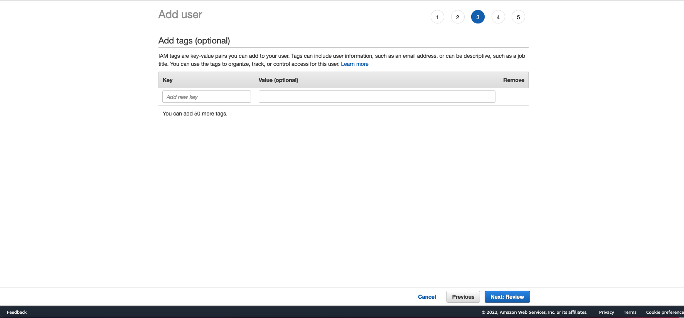

<h1 align="center">NABP Linea de comandos</h1>
<h3 align="center">Mejores practicas para una nueva cuenta de AWS</h3>

- 🔭 [Como crear una nueva cuenta](https://github.com/ELRuncho/nabp#como-crear-una-nueva-cuenta)

- 👤 [Crear usuario administrador](https://github.com/ELRuncho/nabp#crear-usuario-administrador)

- 🚀 [Como instalar nabp](https://github.com/ELRuncho/nabp#como-instalar-nabp)

- 👯 [Comandos core](https://github.com/ELRuncho/nabp#comandos-core)

- 🤝 [Comandos Network](https://github.com/ELRuncho/nabp#comandos-network)

## Como crear una nueva cuenta
1. Abra la [página de inicio de Amazon Web Services (AWS)](https://aws.amazon.com/).
    
2. Elija Create an AWS Account (Crear una cuenta de AWS).
    **Nota:** Si ha iniciado sesión en AWS recientemente, elija Iniciar sesión en la consola. Si Create a new AWS account (Crear una nueva cuenta de AWS) no es visible, elija primero Sign in to a different account (Iniciar sesión con una cuenta diferente) y, a continuación, Create a new AWS account (Crear una nueva cuenta de AWS).
    
3. En Root user email address (Email del usuario raíz), escriba su email, edite el nombre de la cuenta de AWS y, a continuación, elija Verify email address (Verificar email). Se enviará un email de verificación de AWS a esta dirección con un código de verificación.

    **Consejo:** En el caso de la dirección de email del usuario raíz, utilice un buzón o una lista de distribución de email de empresa (por ejemplo, administradores.empresa@ejemplo.com) si su cuenta es una cuenta de AWS profesional. Evite utilizar el email de empresa de una persona (por ejemplo, paulo.santos@ejemplo.com). De este modo, su empresa seguirá teniendo acceso a la cuenta de AWS incluso si un empleado cambia de puesto o deja la empresa. La dirección de email se puede utilizar para restablecer las credenciales de la cuenta. Asegúrese de proteger el acceso a estas listas de distribución. No utilice el inicio de sesión del usuario raíz de la cuenta de AWS para sus tareas cotidianas. Es una práctica recomendada habilitar la autenticación multifactor (MFA) en la cuenta raíz para proteger los recursos de AWS.

    **Consejo:** En el caso del Nombre de la cuenta de AWS, utilice un estándar de denominación de cuentas que permita que el nombre de la cuenta sea reconocible en la factura o en la consola de administración de facturación y costos. Si se trata de una cuenta de empresa, considere utilizar el estándar de denominación organización-objetivo-entorno (por ejemplo, EmpresaEjemplo-auditoría-prod). En caso de que sea una cuenta personal, plantéese utilizar el estándar de denominación nombre-apellido-objetivo (por ejemplo, paulo-santos-cuentadeprueba). Puede cambiar el nombre de la cuenta en la configuración de la cuenta después de registrarse. Para obtener más información, consulte 쮺칩mo cambio el nombre en mi cuenta de AWS?

### Verifique su email

Ingrese el código que reciba y, a continuación, seleccione Verify (Verificar). El código puede tardar unos minutos en llegar. Compruebe su email y la carpeta de spam para el email de código de verificación.

### Cree su contraseña

Ingrese su contraseña de usuario raíz, confirme la contraseña de usuario raíz y, a continuación, seleccione Continue (Continuar).

### Agregue su información de contacto

1. Seleccione Personal (Personal) o Business (Empresa).
    **Nota:** Las cuentas personales y empresariales tienen las mismas características y funciones.
2. Ingrese su información personal o empresarial.
    **Importante:** Para cuentas de AWS empresariales, se recomienda ingresar el número de teléfono de la empresa en lugar de un número de teléfono móvil personal. Configurar una cuenta raíz con una dirección de email o un número de teléfono personales puede provocar que la cuenta no sea segura.
3. Lea y acepte el Contrato de usuario de AWS.
4. Elija **Continuar**.

Recibirá un email para confirmar que se ha creado su cuenta. Puede iniciar sesión en su nueva cuenta con la dirección de email y la contraseña que utilizó para registrarse. No obstante, no podrá utilizar los servicios de AWS hasta que termine de activar la cuenta.

### Agregue un método de pago

En la página **Información de facturación**, ingrese la información de su método de pago y, a continuación, elija Verify and Add (Verificar y agregar).

Si se está registrando en la India para obtener una cuenta de Amazon Internet Services Private Limited (AISPL), debe proporcionar su CVV como parte del proceso de verificación. Asimismo, es posible que tenga que ingresar una contraseña de un solo uso, en función del banco. AISPL realizará un cargo de 2 rupias indias (INR) en el método de pago como parte del proceso de verificación. AISPL reembolsará las 2 INR una vez que se complete la verificación.

Si desea utilizar una dirección de facturación diferente para la información de facturación de AWS, elija **Use a new address** (Utilizar una nueva dirección). A continuación, elija **Verify and Continue** (Verificar y continuar).

**Importante:** No puede continuar con el proceso de registro mientras no agregue un método de pago válido.

### Verifique su número de teléfono

1. En la página Confirme su identidad, seleccione un método de contacto para recibir un código de verificación.
    
2. Seleccione el país o código de región de su número de teléfono en la lista.
3. Ingrese un número de teléfono móvil en el que se le pueda contactar durante los próximos minutos.
4. Si aparece un CAPTCHA, ingrese el código mostrado y luego envíelo.
5. Transcurridos unos instantes, un sistema automatizado le contactará.
6. Escriba el PIN recibido y luego elija **Continuar**.
    

### Elija un plan de AWS Support

En la página Seleccione un plan de soporte, elija uno de los planes de soporte disponibles. Para ver la descripción de los planes de soporte disponibles y sus beneficios, consulte Compare los planes de AWS Support.

Elija Finalizar inscripción.

### Espere a que se active la cuenta

Después de elegir un plan de Support, una página de confirmación le indica que su cuenta está siendo activada. Por lo general, las cuentas se activan en unos pocos minutos, aunque el proceso puede tardar hasta 24 horas.

Puede iniciar sesión en su cuenta de AWS durante ese tiempo. La página de inicio de AWS puede mostrar el botón **Completar el inicio de sesión** durante ese plazo de tiempo, incluso si ya ha completado todos los pasos del proceso de inicio de sesión.

Cuando su cuenta se haya activado por completo, recibirá un email de confirmación. Compruebe su email y la carpeta de spam para encontrar el email de confirmación. Después de recibir este email, tendrá acceso completo a todos los servicios de AWS.

## Crear usuario administrador

### Para crear uno o varios usuarios de IAM (consola)

1. Inicie sesión en la AWS Management Console y abra la consola de IAM en [link](https://console.aws.amazon.com/iam/)
    
2. En el panel de navegación, elija Usuarios y, a continuación, elija Agregar usuarios.
    
3. Escriba el nombre de usuario del nuevo usuario. Este es el nombre de inicio de sesión para AWS. Si quiere agregar varios usuarios, seleccione Add another user (Agregar otro usuario) para cada usuario adicional y escriba sus nombres de usuario. Puede añadir hasta 10 usuarios al mismo tiempo.
    
4. Seleccione el tipo de acceso que tendrá este conjunto de usuarios. Puede seleccionar el acceso mediante programación, el acceso a la AWS Management Console, o ambos.

    * Seleccione **Acceso mediante programación** si los usuarios necesitan obtener acceso a la API, la AWS CLI o Tools for Windows PowerShell. Esto crea una clave de acceso para cada usuario nuevo. Puede ver o descargar las claves de acceso cuando llegue a la página Final.

    * Seleccione **AWS Management Console access** (acceso a la consola) si los usuarios necesitan obtener acceso a la AWS Management Console. Esto crea una contraseña para cada usuario nuevo.

    - En **Console password (Contraseña de la consola)**, elija una de las opciones siguientes:

        - **Autogenerated password (Contraseña generada automáticamente)**. Cada usuario obtiene una contraseña generada de forma aleatoria que cumple la política de contraseñas de cuentas. Puede ver o descargar las contraseñas cuando llegue a la página Final.

        - **Custom password (Contraseña personalizada)**. A cada usuario se le asigna la contraseña que se escribe en el cuadro.

    - (Opcional) Le recomendamos que seleccione **Require password reset (Requerir restablecimiento de contraseña)** para asegurarse de que los usuarios estén obligados a cambiar su contraseña la primera vez que inicien sesión.

5. Elija Next: Permissions (Siguiente: Permisos).

6. En la página Set permissions (Establecer permisos), especifique la forma en que quiera asignar permisos a este conjunto de nuevos usuarios. Elija una de las siguientes tres opciones:
    
    

    - **Add user to group (Añadir un usuario al grupo)**. Elija esta opción si desea asignar los usuarios a uno o a varios grupos que ya tienen políticas de permisos. IAM muestra una lista de los grupos de la cuenta, junto con sus políticas asociadas. Puede seleccionar uno o varios grupos existentes o elegir Create group (Crear grupo) para crear un grupo nuevo. Para obtener más información, consulte Cambio de los permisos de un usuario de IAM.

    - **Copy permissions from existing user (Copiar permisos de un usuario existente)**. Elija esta opción para copiar todas las suscripciones a grupos, las políticas administradas asociadas, las políticas insertadas integradas y los límites de permisos de un usuario existente en los usuarios nuevos. IAM muestra una lista de los usuarios de la cuenta. Seleccione el usuario cuyos permisos se acerquen lo máximo posible a las necesidades de los usuarios nuevos.

    - **Attach existing policies directly (Asociar las políticas existentes directamente)**. Elija esta opción para ver una lista de las políticas administradas por AWS y de las políticas administradas por el cliente de la cuenta. Seleccione las políticas que desea asociar a los nuevos usuarios o elija Create policy (Crear política) para abrir una nueva pestaña del navegador y crear una nueva política desde cero. Para obtener más información, consulte el paso 4 del procedimiento Crear políticas de IAM. Una vez creada la política, cierre la pestaña y vuelva a la pestaña original para añadir la política al nuevo usuario. Como práctica recomendada, es conveniente que primero asocie sus políticas a un grupo y después haga a los usuarios miembros de los grupos adecuados.

7. (Opcional) Configure un límite de permisos. Esta es una característica avanzada.

    Abra la sección **Set permissions boundary (Configurar límite de permisos)** y elija **Utilice a permissions boundary to control the maximum user permissions (Utilizar un límite de permisos para controlar los permisos que puede tener el usuario como máximo)**. IAM muestra una lista de las políticas administradas por AWS y de las políticas administradas por el cliente de la cuenta. Seleccione la política que desea usar para el límite de permisos o elija **Create policy (Crear política)** para abrir una pestaña nueva del navegador y crear una política nueva desde cero. Para obtener más información, consulte el paso 4 del procedimiento Crear políticas de IAM. Una vez creada la política, cierre la pestaña y vuelva a la pestaña original para seleccionar la política que va a usar para el límite de permisos.

8. Elija Next: Tags (Siguiente: Etiquetas).

9. (Opcional) Añadir metadatos al rol asociando las etiquetas como pares de clave-valor. Para obtener más información acerca del uso de etiquetas en IAM, consulte Etiquetado de recursos de IAM.
    

10. Elija **Next: Review (Siguiente. Revisar)** para ver todas las opciones que ha realizado hasta este punto. Cuando esté listo para continuar, elija Create user **(Crear usuario)**.
    

11. Para ver las claves de acceso de los usuarios (los ID de las claves de acceso y las claves de acceso secretas), elija **Show (Mostrar)** junto a cada contraseña y clave de acceso secreta que desee ver. Para guardar las claves de acceso, elija **Download .csv (Descargar archivo .csv)** y, a continuación, guarde el archivo en un lugar seguro. 

    

## Como instalar nabp

## Comandos Core

## Comandos Network

<h3 align="left">Connect with me:</h3>

<h3 align="left">Languages and Tools:</h3>

              
