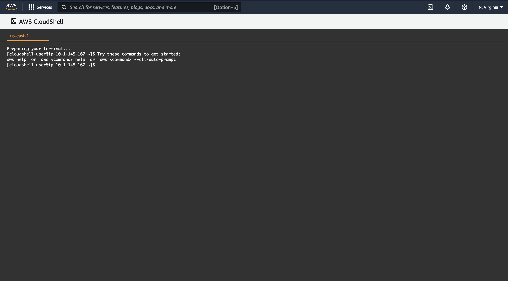

<h1 align="center">NABP Command line</h1>
<h3 align="center">Best Practices for a new AWS Account</h3>

## Tabla de Contenido

- 🔭 [How to create a new account](https://github.com/ELRuncho/nabp#como-crear-una-nueva-cuenta)

- 👤 [Create new administrator user](https://github.com/ELRuncho/nabp#crear-usuario-administrador)

- 🚀 [How to install nabp](https://github.com/ELRuncho/nabp#como-instalar-nabp)

- 👯 [Core Commands](https://github.com/ELRuncho/nabp#comandos-core)

- :eye: [Monitor Commands](https://github.com/ELRuncho/nabp#comandos-monitor)

- 🤝 [Network Commands](https://github.com/ELRuncho/nabp#comandos-network)


## How to create a new account
1. Access the [Amazon Web Services (AWS) home page](https://aws.amazon.com/).
    
2. Click on Create an AWS Account.
    **Note:** If you've recently signed in to AWS, choose Sign in to the console. If Create a new AWS account isn't visible, first choose Sign in to a different account and then Create a new AWS account.
    
3. For Root user email address, type your email, edit your AWS account name, and then choose Verify email address. A verification email from AWS will be sent to this address with a verification code.

    **Advice:** For the root user email address, use a company email mailbox or distribution list (for example, admins.company@example.com) if your account is a professional AWS account. Avoid using a person's company email (for example, paulo.santos@example.com). This way, your company will continue to have access to the AWS account even if an employee changes jobs or leaves the company. The email address can be used to reset account credentials. Be sure to protect access to these distribution lists. Don't use the AWS account root user login for your day-to-day tasks. It's a best practice to enable multi-factor authentication (MFA) on the root account to protect AWS resources.

    **Advice:** For the AWS Account Name, use an account naming standard that allows the account name to be recognizable on the bill or in the billing and cost management console. If this is an enterprise account, consider using the organization-target-environment naming standard (for example, ExampleCompany-audit-prod). If this is a personal account, consider using the firstname-lastname-target naming standard (for example, paulo-santos-testaccount). You can change the account name in the account settings after registration. For more information, see How do I change the name in my AWS account?

### Verify your email

Enter the code you receive, then select Verify. The code may take a few minutes to arrive. Check your email and spam folder for the verification code email.


### Create your password

Enter your root user password, confirm the root user password, and then select Continue.


### Add your contact information

1. Select Personal or Business.
    **Note:** Personal and business accounts have the same features and functions.
2. Enter your personal or business information.
    **Important:** For enterprise AWS accounts, we recommend that you enter your business phone number instead of a personal mobile phone number. Setting up a root account with a personal email address or phone number can make the account insecure.
3. Read and agree to the AWS User Agreement.
4. Click **Continue**.


You will receive an email to confirm that your account has been created. You can sign in to your new account with the email address and password you used to sign up. However, you will not be able to use AWS services until you finish activating your account.

### Add a payment method

On the **Billing Information** page, enter your payment method information, then choose Verify and Add.

If you are registering in India for an Amazon Internet Services Private Limited (AISPL) account, you must provide your CVV as part of the verification process. You may also need to enter a one-time password, depending on the bank. AISPL will charge 2 Indian Rupees (INR) to the payment method as part of the verification process. AISPL will refund the 2 INR once verification is complete.

If you want to use a different billing address for your AWS billing information, choose **Use a new address**. Then choose **Verify and Continue**.

**Important:** You cannot proceed with the registration process until you add a valid payment method.


### Verify your phone number

1. On the Confirm Your Identity page, select a contact method to receive a verification code.
    
2. Select the country or region code of your phone number from the list.
3. Please enter a mobile phone number where you can be reached within the next few minutes.
4. If a CAPTCHA appears, enter the code shown and then submit it.
5. After a few moments, an automated system will contact you.
6. Enter the received PIN and then choose **Continue**.
    

### Choose an AWS Support Plan

On the Select a support plan page, choose one of the available support plans. For a description of available support plans and their benefits, see Compare AWS Support Plans.

Click Finish Enrollment.


### Wait for the account to be activated

After choosing a Support plan, a confirmation page tells you that your account is being activated. Accounts are usually activated within a few minutes, although the process can take up to 24 hours.


You can sign in to your AWS account during that time. The AWS home page may display a **Complete Sign In** button during that time, even if you've already completed all steps of the sign-in process.

When your account has been fully activated, you will receive a confirmation email. Check your email and spam folder to find the confirmation email. After receiving this email, you will have full access to all AWS services.

## Create admin user

### To create one or more IAM users (console)

1. Sign in to the AWS Management Console and open the IAM console at [link](https://console.aws.amazon.com/iam/)
    
2. In the navigation pane, choose Users, and then choose Add Users.
    
3. Type the username of the new user. This is the login name for AWS. If you want to add multiple users, select Add another user for each additional user and enter their usernames. You can add up to 10 users at the same time.
    
4. Select the type of access that this set of users will have. You can select programmatic access, access to the AWS Management Console, or both.

    * Select **Programmatic access** if users need access to the API, AWS CLI, or Tools for Windows PowerShell. This creates a password for each new user. You can view or download the access keys when you reach the Finish page.

    * Select **AWS Management Console access** if users need access to the AWS Management Console. This creates a password for each new user.

    - For **Console password**, choose one of the following options:

        - **Autogenerated password**. Each user gets a randomly generated password that complies with the account password policy. You can view or download the passwords when you get to the Finish page.

        - **Custom password**. Each user is assigned the password that is typed in the box.

    - (Optional) We recommend that you select **Require password reset** to ensure that users are required to change their password the first time they log in.


5. Choose Next: Permissions.

6. On the Set permissions page, specify how you want to assign permissions to this set of new users. Choose one of the following three options:
    
    

    - **Add user to group**. Choose this option if you want to assign users to one or more groups that already have permission policies. IAM displays a list of the account's groups, along with their associated policies. You can select one or more existing groups or choose Create group to create a new group. For more information, see Changing an IAM User's Permissions.

    - **Copy permissions from existing user**. Choose this option to copy all group memberships, associated managed policies, built-in inline policies, and permission limits from an existing user to new users. IAM displays a list of users in the account. Select the user whose permissions are as close as possible to the needs of the new users.

    - **Attach existing policies directly**. Choose this option to see a list of AWS managed policies and customer managed policies for the account. Select the policies you want to associate with new users, or choose Create policy to open a new browser tab and create a new policy from scratch. For more information, see step 4 of the Create IAM Policies procedure. After the policy is created, close the tab and return to the original tab to add the policy to the new user. As a best practice, you might want to first associate your policies with a group, and then make users members of the appropriate groups.

7. (Optional) Set a permission boundry. This is an advanced feature.

    Open the **Set permissions boundary** section and choose **Use a permissions boundary to control the maximum user permissions** . IAM displays a list of AWS managed policies and customer managed policies for the account. Select the policy you want to use for the permission limit, or choose **Create policy** to open a new browser tab and create a new policy from scratch. For more information, see step 4 of the Create IAM Policies procedure. Once the policy is created, close the tab and return to the original tab to select the policy to use for the permission limit.

8. Choose Next: Tags.

9. (Optional) Add metadata to the role by associating the tags as key-value pairs. For more information about using tags in IAM, see IAM Resource Tagging.
    

10. Choose **Next: Review** to see all the options you have made up to this point. When you're ready to continue, choose Create user **(Create user)**.
    

11. To view user access keys (Access Key IDs and Secret Access Keys), choose **Show** next to each password and secret access key you want to view. To save the access keys, choose **Download .csv**, and then save the file in a safe place. 

    

    **important:**
        This is the only opportunity you have to view or download your secret access keys, and you must provide this information to your users before they can use the AWS API. Keep the new User Access Key ID and Secret Access Key in a safe place. You will no longer have access to the secret access key after this step.

    

12. Provide each user with their credentials. On the final page you can choose Send email next to each user. Your local mail client will open with a draft that you can customize and send. The email template contains the following details for each user:

    - Username

    - Account login page URL. Use the following example and replace with the correct account alias or ID number:

        `https://AWS-account-ID or alias.signin.aws.amazon.com/console`

    For more information, see [How IAM users sign in to AWS.](https://docs.aws.amazon.com/es_es/IAM/latest/UserGuide/id_users_sign-in.html) 

## How to install nabp

### Prerequisites

1. Python3 or superior y pip [Python](https://www.python.org/downloads/)
2. AWS CLI [aws-cli](https://docs.aws.amazon.com/cli/latest/userguide/getting-started-install.html)
    - When installing the command line, using the command `aws configure`, uses the keys obtained from the admin user created earlier.
        ```
            $ aws configure
            AWS Access Key ID: <Access key del usario>
            AWS Secret Access Key: <Access key del usario>
            Default region name: us-east-1 <us-east-1 es la region por defecto>
        ```
**Important:**
    On Windows, if python or the AWS cli, once installed, are not found from the command prompt, they must be added to the PATH environment variable.
    To find the folder containing the awscli or python you can use the command `where`:

        
        C:\> where /R c:\ <paquete aws o python/py>

### You don't have a Linux computer or your computer has controls that prevent you from installing? 
In this case you can make use of *AWS CLOUDSHELL* to be able to have a console environment without having to deploy additional resources.

To use CloudShell you just have to search for the service in the console:


Once you are in CloudShell you can configure aws cli that is already installed, as well as python



### Instalation

1. Download nabp from github either by downloading the zip or by cloning the repository

    `$ git clone https://github.com/ELRuncho/nabp.git`

2. Enter the folder:

    `$ cd nabp`

3. Install nabp using pip:

    `$ pip3 install .`

4. Confirm the installation:

    `$ nabp --help`

    - If it installed successfully you should see the following output:
        ```
            Usage: nabp [OPTIONS] COMMAND [ARGS]...

            Options:
                --profile TEXT  perfil preferido de awscli
                --help          Show this message and exit.

            Commands:
                core     Comandos core
                network  Comandos networking
        ```
5. (OPTIONAL) once napb is installed you can define the awscli profile to use with nabp using the option`--profile`

    `$ nabp --profile <nombre perfil awslcli>`

    If no profile is defined with the option `--profile` nabp uses the awscli default profile

## Core Commands

These commands create base configuration for the account

### security

This command enables **Access Analyzer** which automatically analyzes created IAM policies based on user and resource usage patterns and alerts if policies are too loose and violate the principle of least privilege.

This command also creates four groups of IAM users, assigns them specific permissions for each group, and also creates a user in each group. The groups you create are as follows:

- **Administrators:** Group for Administrators, this group has full administrator permissions for aws
- **Developers:** Group for Developers, this group has power user permissions, it allows creating resources but not modifying security policies or billing information
- **Auditors:** Group for Auditors, this group has read-only permissions, designed for auditors who need to be able to see and review resources, policies, configurations, etc. But it does not allow to make any changes
- **Finance:** Group for Finance, this group has permissions to access only billing and cost information as well as being able to create budgets

This command has the following options (none are required to run the command):

- `--analyzer_name`: Custom name for the Access Analyzer 
- `--admin_g_name`: Custom name for the admin group
- `--dev_g_name`: Custom name for developer group
- `--audit_g_name`: Custom name for the auditor group
- `--fin_g_name`: Custom name for finance group

**Example:**

Without options:

`$ nabp core security`

Using opciones:
    
`$ nabp core security --analyzer_name miAnalyzer --admin_g_name AdminG --dev_g_name Devs`

### budget

This command creates a budget in the aws account and two alerts, one when 60% of the consumption budget is met and another when 90% is met. These alerts will be sent to the email defined in the command

This command has the following options:

- `--name`: Budget custom name
- `--amount` **(required)**: Maximum amount of the budget, the value is given in dollars (USD)
- `--email` **(required)**: Email to which the alerts will be sent

**Example:**

Without name:

`$ nabp core budget --amount 200 --email admin@empresa.com`

Using name:

`$ nabp core budget --name mybudget --amount 200 --email admin@empresa.com`

## Monitor Commands

### trail

This command creates a bucket to store cloudtrail logs and enables cloudtrail for all regions within your new account.

This command has the following options:

- `--name`: This option allows you to specify the name of the trail to be created in AWS CloudTrail, the default name is *nabp-trail*

**Example:**

Without options:

`$ nabp monitor trail`

Custom name for the trail:

`$ nabp monitor trail --name mitrail `


### config

## Network Commands

### create

This command creates a VPC with three public subnets, three private subnets, IGW, a NatGateway, and the necessary routes and routing tables.

This command has the following options:

- `--range`: This option allows you to specify the CIDR range of the VPC in *X.X.X.X/X* format, its default value is 10.0.0.0/16
- `--region`: This option allows you to specify the region where you want to deploy the vpc

**Example:**

Without options:

`$ nabp network create`

With options:

`$ nabp network create --range 172.0.0.0/16`

<h3 align="left">Connect with me:</h3>
<p align="left">
<a href="https://www.linkedin.com/in/rafael-hernando-franco/" target="blank"></a>
</p>

<h3 align="left">Languages and Tools:</h3>
<p align="left"> <a href="https://aws.amazon.com" target="_blank" rel="noreferrer">  </a> <a href="https://www.gnu.org/software/bash/" target="_blank" rel="noreferrer">  </a> <a href="https://git-scm.com/" target="_blank" rel="noreferrer">  </a> <a href="https://www.linux.org/" target="_blank" rel="noreferrer">  </a>  <a href="https://www.python.org" target="_blank" rel="noreferrer">  </a>  </p>